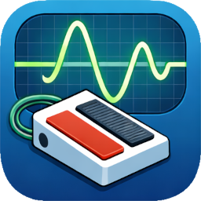
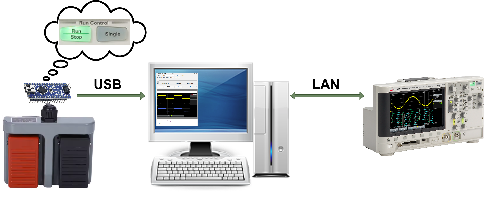
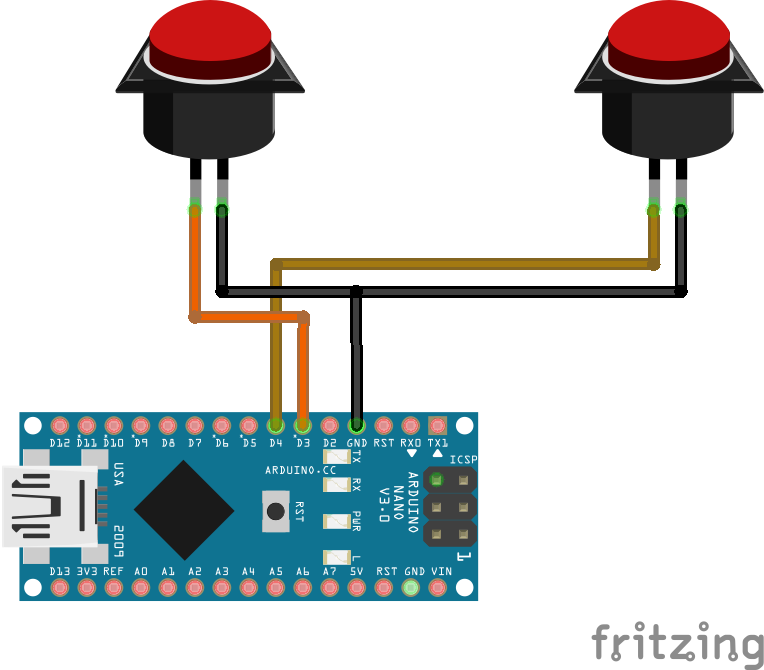
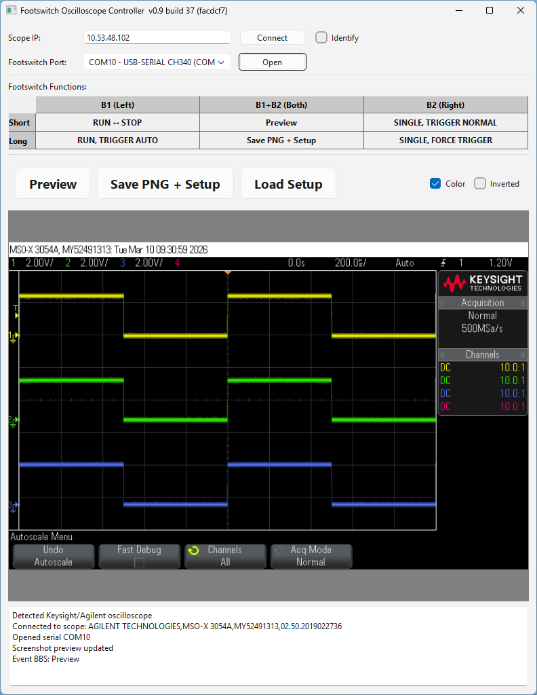

# Scope Footswitch Trigger 
[](https://github.com/grafmar/scope-footswitch-trigger/releases)
[](LICENSE)
[](https://www.python.org/)
[](https://www.arduino.org/)

Scope Footswitch Trigger enables hands-free control of an oscilloscope using a dual footswitch connected through an Arduino Nano.

The Arduino detects short and long presses on two foot pedals and sends events via USB (Serial) to a PC. A Python application running in the background receives these events and remotely controls the oscilloscope over LAN using SCPI commands.

This setup is ideal for lab environments where both hands are occupied — for example during probing, debugging hardware, or EMC measurements.

## 🧪 Usage
<p align="center">
  
</p>

- Connect the dual footswitch to the PC via USB.
- Connect the oscilloscope to the network and obtain its IP address (via Utility → I/O on the Keysight/Agilent oscilloscope).
  - Activate VX11 on LeCroy oscilloscopes
- Start `OsciFootswitch.exe` (or `python OsciFootswitch.py`).
- Enter the oscilloscope’s IP address and click **\<Connect\>**.
- Use the "Identify Oscilloscope" checkbox to display a text box on the oscilloscope screen to verify the correct device.
- Select the correct serial port of the footswitch (identifier "USB-Serial CH340") and click **\<Open\>**.

→ The footswitch is ready.


## 🎯 Features
- Detects short and long presses for both pedals individually and if both are pressed at the same time
- Remote oscilloscope control via LAN
- Trigger control:
  - RUN / START
  - STOP
  - SINGLE (Single Shot)
- Toggle between:
  - Normal Trigger Mode
  - Auto Trigger Mode
- Capture and store:
  - Screenshot
  - Oscilloscope setup


## ⚙️ How It Works
1. The Arduino monitors two input pins connected to a dual footswitch.
2. Short and long presses are detected directly on the Arduino.
3. Events are sent via USB Serial (e.g. B1S, B1L, B2S, B2L, BBS, BBL).
4. The Python application:
  - Opens the configured serial port
  - Connects to the oscilloscope via IP (LAN)
  - Maps footswitch events to SCPI commands
5. The oscilloscope executes the corresponding trigger or screenshot command.


## 🤖 Hardware
A dual footswitch is connected to an Arduino Nano. The left switch connects to D3 and the right switch to D4 of the Arduino Nano. The switches connect to GND.

That's all for the hardware. The Arduino is powered and connected to a PC through its USB connector.

The Arduino code `footswitch.ino` debounces the switch events, detects short and long presses and sends the corresponding event string through USB-serial.

<p align="center">
  
</p>

## 👨‍💻 Software
The PC application is compiled from a Ppython script. If you want to adapt the code, you have to install several Python packages, which are listed in `src/pc_app/requirements.txt`. You can apply them by:
```bash
pip install -r requirements.txt
```

To compile the Python to a Windows EXE file including all the necessary libraries you can simply execute the batch file:
```bash
.\src\build_scripts\build.bat
```
→ The EXE will be available at `.\src\build_scripts\dist\OsciFootswitch\OsciFootswitch.exe`


### 🏗️ SW-Architecture
<p align="center">
  
</p>
The GUI has the configuration part at the top, then a part that explains the footswitch function mappings. Below that is the screenshot section and at the bottom the log.

Upon connecting to the oscilloscope's IP the common SCPI/VISA identifier command `*IDN?` is used to identify the manufacturer and type of the oscilloscope. Depending on that identifier string the corresponding implementation for that oscilloscope is used. If the brand is not recognized the Keysight/Agilent implementation is used.

When the serial port of the footswitch is configured, the incoming events on the serial port are mapped to the corresponding oscilloscope functions and the SCPI/VISA commands are sent to the oscilloscope.

When a screenshot is captured, a setup file is also stored with the same basename. This setup file can then be reapplied to the scope later if needed.


### 📻 Supported Oscilloscopes
- ✅ Keysight/Agilent 2000 X-Series (DSOX2004A)
- ✅ Keysight/Agilent 3000 X-Series (MSOX3054A)
- ✅ Keysight/Agilent 4000 X-series (MSOX4024A)
- ✅ Keysight/Agilent 6000 X-series (DSOX6004A)
- ✅ Keysight/Agilent 7000 Series (MSO7054A)
- ✅ LeCroy Waverunner 6100
- ✅ LeCroy Waverunner 44XI
- ❌ Hameg/R&S HMO3000 Series (HMO3524) [documentation](doc/HMO3524_documentation.md)


SCPI/VISA Documentations:
- [2000 X-Series Programmer's Guide](https://www.keysight.com/us/en/assets/9018-06893/programming-guides/9018-06893.pdf)
- [3000 X-Series Programmer's Guide](https://www.keysight.com/us/en/assets/9018-06894/programming-guides/9018-06894.pdf)
- [4000 X-Series Programmer's Guide](https://www.keysight.com/us/en/assets/9018-06976/programming-guides/9018-06976.pdf)
- [6000 Series Programmer's Guide](https://www.keysight.com/ch/de/assets/9018-08107/programming-guides/9018-08107.pdf)
- [7000A Series Programmer's Guide](https://www.keysight.com/us/en/assets/9018-06630/programming-guides/9018-06630.pdf)
- [Waverunner Remote Control Manual](https://cdn.teledynelecroy.com/files/manuals/wr2_rcm_revb.pdf) 
- [Hameg/R&S HMO3000 Series SCPI Programmers Manual](https://www.batronix.com/files/Rohde-%26-Schwarz/Oscilloscope/HMO30xx/HMO3000_ProgrammingManual_en.pdf)


## 🚀 Advantages and Example Use Cases
- Hands-free operation → Trigger a single acquisition while holding probes
- Quickly toggle between Auto and Normal trigger during debugging
- Capture a screenshot including instrument setup without touching the scope
- Improve workflow in production test environments
- Minimal hardware cost
- Works in the background
- No modification of the oscilloscope required
- Fully scriptable and extendable
