# Footswitch Hardware

This project uses an off-the-shelf dual footswitch combined with an Arduino Nano to provide two USB-connected footswitch inputs for the PC application.

A custom 3D-printed enclosure houses the Arduino Nano and a small interface PCB and is mounted directly to the footswitch.

  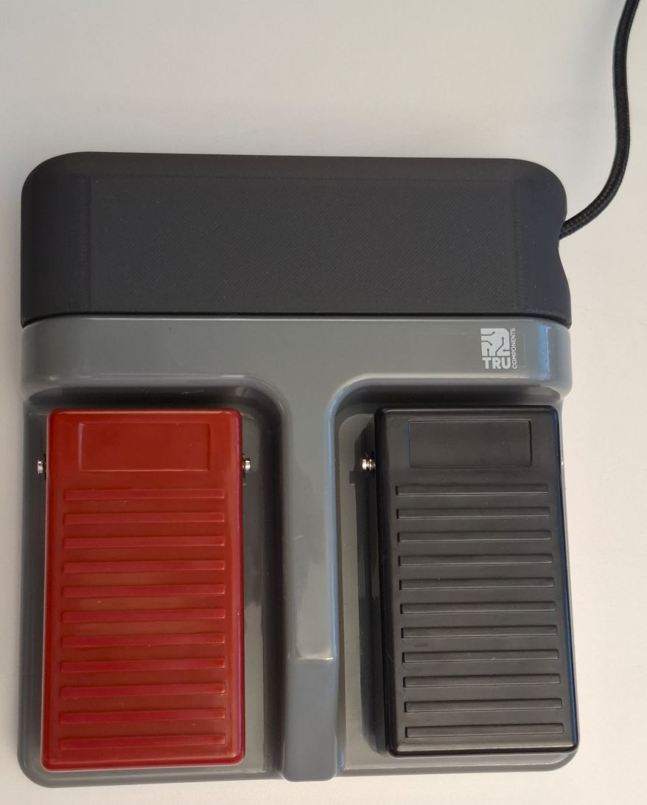

## Required Hardware

* Dual footswitch — TRU COMPONENTS TC-6648040, available from [Conrad.ch](https://www.conrad.ch/de/p/tru-components-fussschalter-250-v-ac-16-a-2-pedale-2-oeffner-2-schliesser-1-st-1662010.html)

  * Other similar dual footswitches can also be used, for example from [AliExpress](https://de.aliexpress.com/w/wholesale-double-footswitch.html)
* Arduino Nano
* Female pin headers for Arduino Nano
* Molex KK 254, 4-pin, right-angle header (Molex 22-05-7048)
* Matching Molex KK 254 connector housing with crimp contacts
* Stripboard / veroboard, or a custom PCB
* Wires
* M3 bolts and nuts
* Press-in threaded M3 inserts ([Bossard AG, 1386743, B3/BN1054](https://www.bossard.com/ch-en/eshop/threaded-inserts-for-press-in-for-plastic-materials/press-in-threaded-inserts-without-head-for-thermoplastics-and-thermosets/p/1054/))

## Interface PCB

The PCB provides the electrical connection between the footswitch and the Arduino Nano.

It contains:

* A Molex KK 254 connector for the footswitch
* An Arduino Nano mounted on female pin headers
* Four mounting holes for attaching the PCB to the enclosure

The circuit is very simple:

| Arduino | Footswitch           | Function    |
| ------- | -------------------- | ----------- |
| D3      | Left switch (red)    | Left pedal  |
| D4      | Right switch (black) | Right pedal |
| GND     | Switch common        | Ground      |

Both switches connect their respective Arduino input to GND when pressed.

  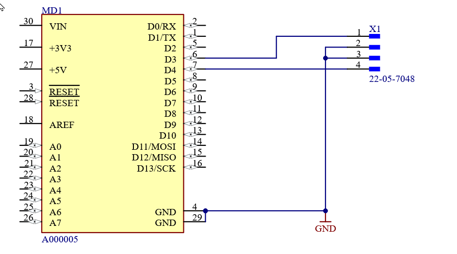

### Stripboard Version

The PCB can be built using a small piece of stripboard instead of a manufactured PCB. Nevertheless, if you want a manufactured PCB, here is the [fabrication data](../../hw/FAB-Labor_ScopeFootswitchTrigger-A0.zip).

When building the stripboard version, pay particular attention to the notch required for the screw that attaches the enclosure to the footswitch.

The following images show an example layout viewed from the top:

  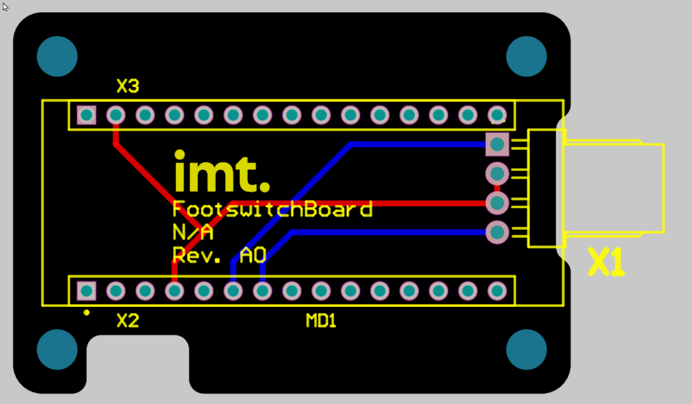
  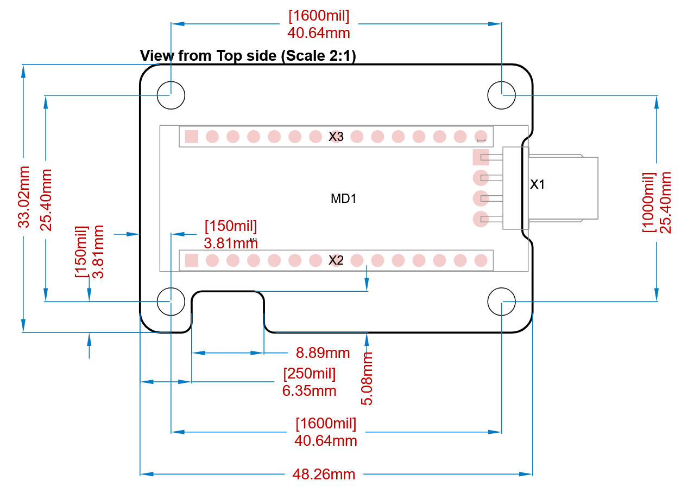

  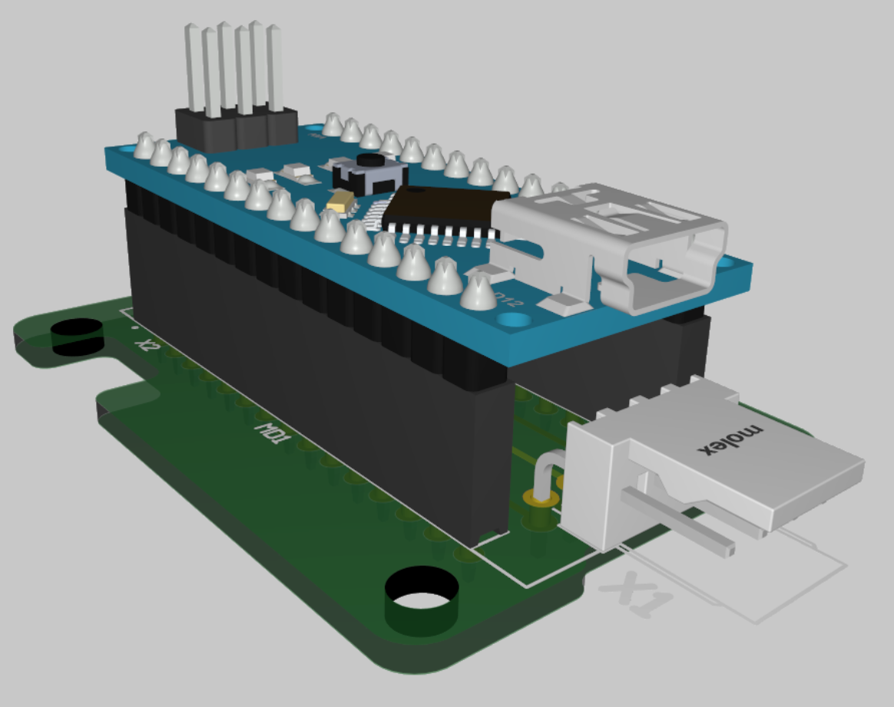

## 3D-Printed Enclosure

The enclosure consists of a top and bottom part and is mounted directly to the footswitch using M3 bolts and nuts.

For the PCB and housing screws, the screw holes are designed for M3 heat-set threaded inserts. These inserts can be installed by gently melting them into the plastic using a soldering iron.

  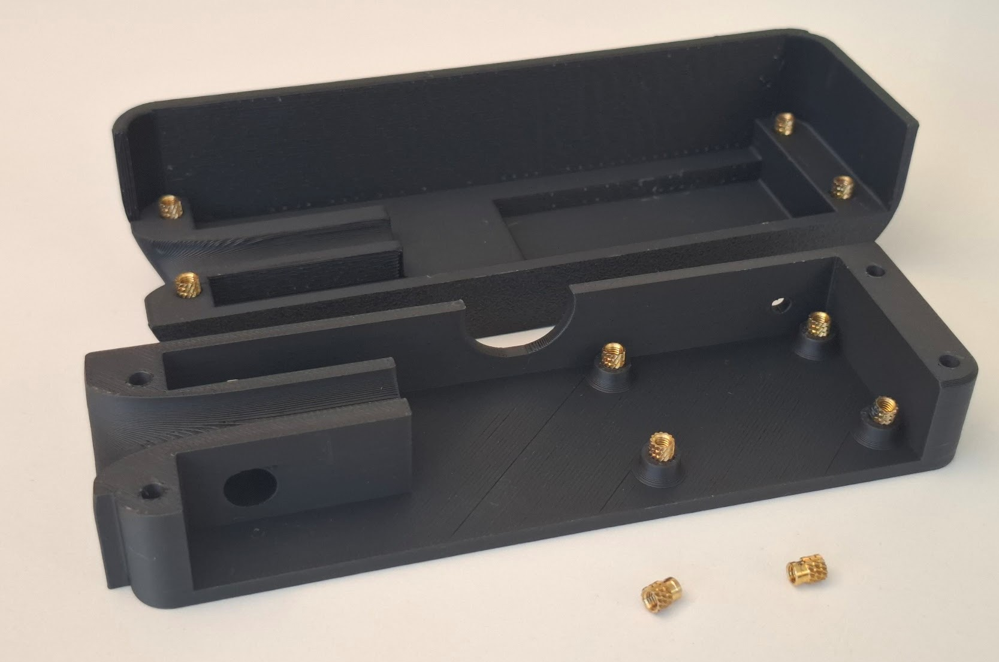
  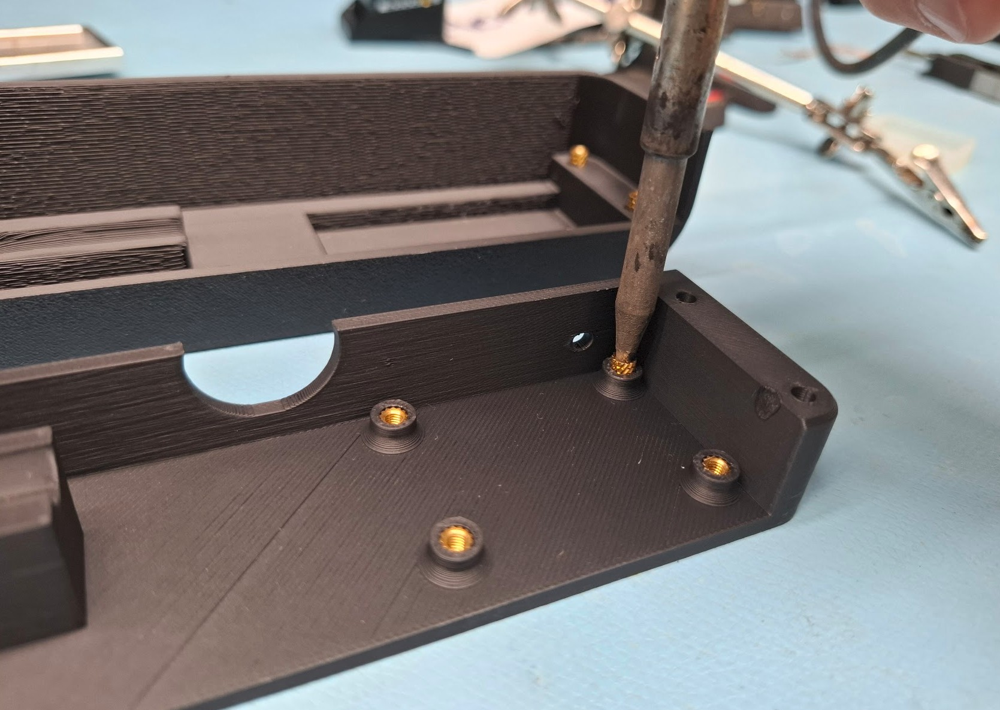
  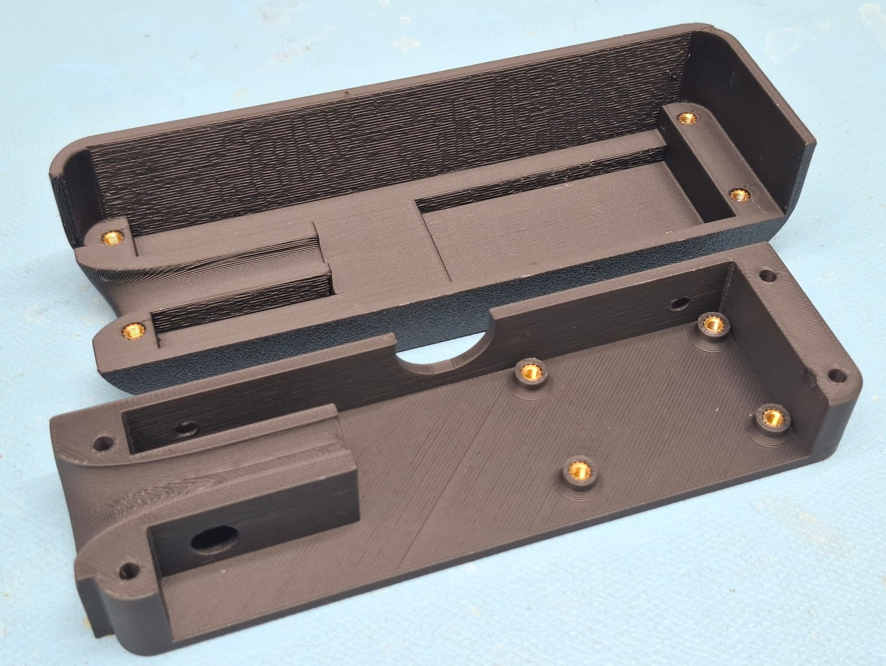

Before mounting the enclosure, the required holes in the footswitch need to be drilled. A 3D-printed drilling jig is provided to simplify this process.

**Drilling jig:**
[OsciFootswitchHousing_DrillingJig.stl](../../housing/OsciFootswitchHousing_DrillingJig.stl)

The bottom part of the enclosure can then be mounted to the footswitch:

**Enclosure bottom:**
[OsciFootswitchHousing-BaseBodyBottom.stl](../../housing/OsciFootswitchHousing-BaseBodyBottom.stl)

The top part is attached to the bottom part using M3 bolts:

**Enclosure top:**
[OsciFootswitchHousing-BaseBodyTop.stl](../../housing/OsciFootswitchHousing-BaseBodyTop.stl)

## Assembly

The wires are soldered directly to the two footswitches and terminated with crimp contacts for the Molex KK 254 connector.

The connector is then plugged into the interface PCB, which is mounted inside the bottom part of the enclosure.

After connecting the USB cable to the Arduino Nano, the cable can be secured with a zip tie to provide strain relief.

Finally, the enclosure can be closed using the M3 bolts.

  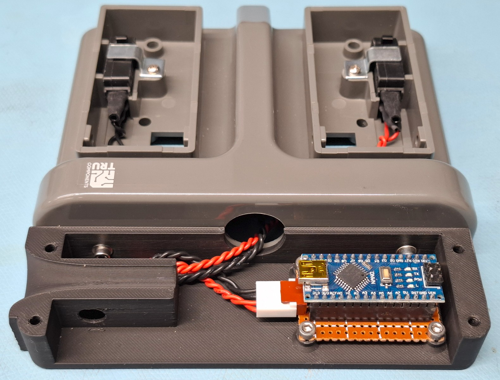
  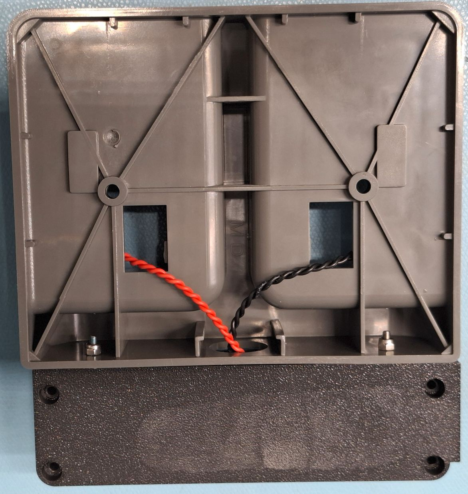
  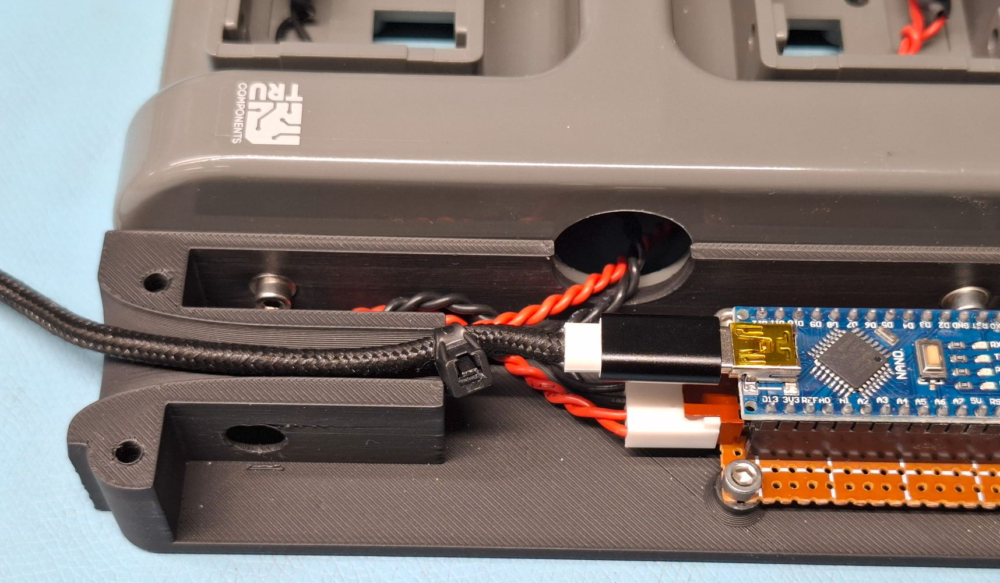
  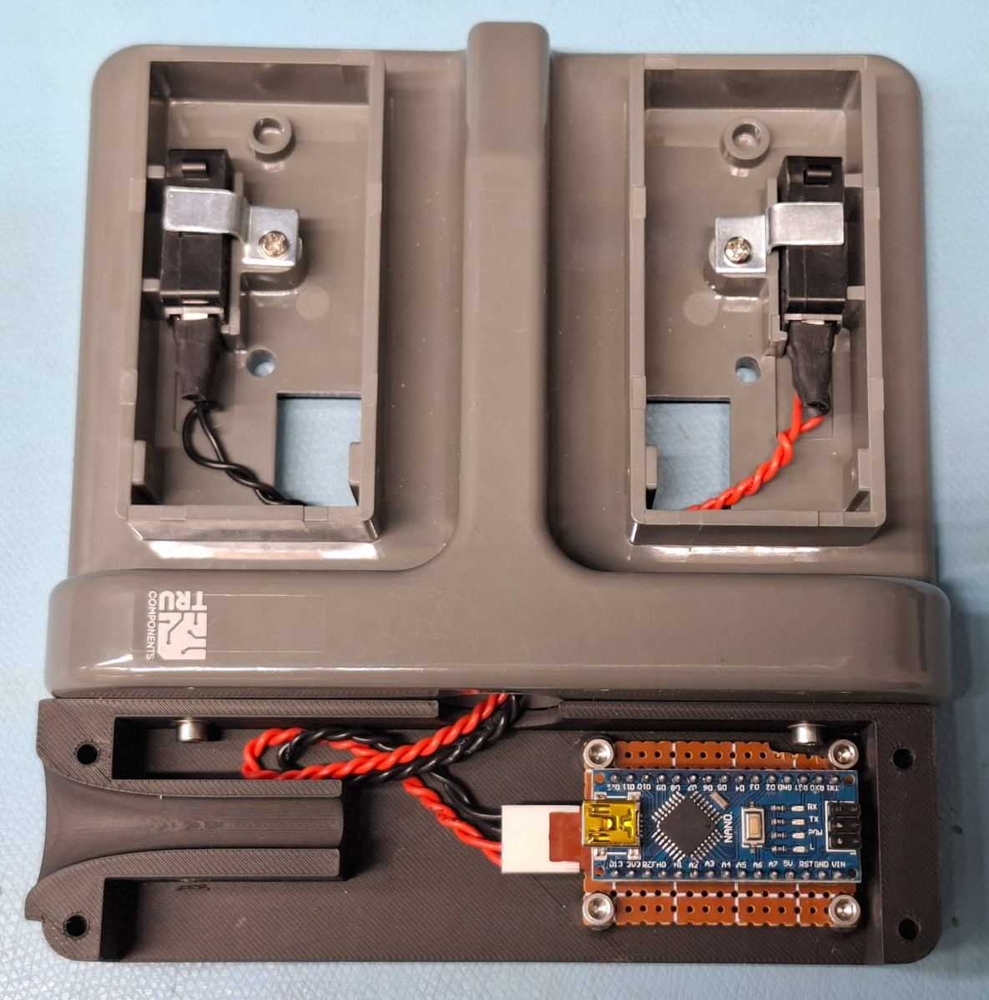

